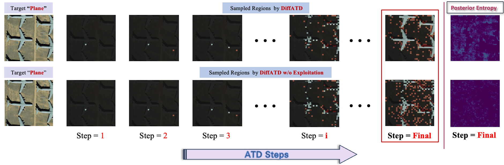

# DiffATD 
Implementation of _Online Feedback Efficient Active Target Discovery in Partially Observable Environments_

<div align="center">

[](https://arxiv.org/abs/2505.06535)

[Anindya Sarkar*](https://scholar.google.co.in/citations?user=2hQyYz0AAAAJ&hl=en),
[Binglin Ji*](https://keving396.github.io/kevinji.github.io//),
[Yevgeniy Vorobeychik](https://vorobeychik.com/)
  

</div>

This repository is the official implementation of the **NeurIPS 2025 paper** [_Online Feedback Efficient Active Target Discovery in Partially Observable Environments_](https://arxiv.org/abs/2505.06535). In this work, we introduce Diffusion-guided Active Target Discovery (DiffATD), a novel method that leverages diffusion dynamics for active target discovery within a limited sampling budget. 

## Installation
Install required Tensorflow, JAX and Keras version:
```bash
pip install --extra-index-url https://pypi.nvidia.com tensorflow[and-cuda]==2.15.0
pip install --find-links https://storage.googleapis.com/jax-releases/jax_cuda_releases.html jax[cuda12_pip]==0.4.26
pip install --upgrade keras==3.1.1
```
Use the following commands to install the necessary dependencies to run the code:
```bash
pip install --upgrade keras-cv
pip install wandb albumentations torchmetrics ax-platform
```

## Train your own diffusion model:
* Train your own diffusion model using:
* `python train_ddim.py --config=/path/to/config --data_root=/path/to/data/root --run_dir=/path/to/save/model/`.
* For example, train on MNIST using:
* `train_ddim.py --config=configs/training/ddim_train_mnist.yaml --data_root=data/ --run_dir=trained_models/`
* config your data in .yaml file


## Inference DiffATD
* First, choose one of the configs in `configs/inference`, you can edit this config.
* Then run inference using:
* `python inference_diffatd.py --config=/path/to/inference/config --data_root=/path/to/data/root --target_img=/path/to/target/img`
* e.g. `python inference_diffatd.py --config=configs/inference/face.yaml --data_root=data --target_img sample_images/07013.png --mask_img sample_images/07013_mask.png` 
* Your results will be saved in `trained_models/your_model/inference/DiffATD`.


## NOTE:
* If you want to test MNIST, please first modify reward model's parameters in `pix_nn.py`, then modify `datasets.py`'s read_image function's channels to 1, and modify `DiffATD.py`'s' block_size to 1, to reproduce the results. It will still be fine if you want to do block_size larger than 1.
